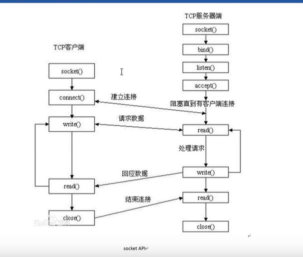

## Socket编程
socket整体流程如下所示：


1. socket函数：创建套接字
```c++
#include<sys/socket.h>
int socket(int domain, int type, int protocol);
    //domain: AF_INET/AF_INET6/AF_UNIX
    //type: SOCK_STREAM/SOCK_DGRAM
    //protocol: 0
    //返回值：成功则返回对应的文件描述符，失败返回-1
```
2. bind函数：给socket绑定一个地址结构（IP:PORT）
```c++
int bind(int sockfd, const struct sockaddr *addr,
        socklen_t addrlen);
    //sockfd:就是socket函数返回的文件描述符
    //struct sockaddr__in addr_in:
    //  addr_in.sin_family = AF_INET
    //  addr_in.sin_port = htons(8888)
    //  addr_in.sin_addr.s_addr = htonl()
    //addr:应该传入(sockaddr*)&addr_in
    //addrlen:sizeof(addr_in)
    //返回值：成功返回0，失败返回-1
```
3. listen函数（不阻塞监听）：设置同时与服务器建立连接的客户端上限数
```c++
int listen(int sockfd, int backlog);
    //sockfd:就是socket函数返回的文件描述符
    //backlog:上限数值。最大为128
    //返回值：成功返回0，失败返回-1
```

4. accept函数（阻塞监听）：（阻塞）等待客户端建立连接
```c++
int accept(int sockfd, struct sockaddr *addr, 
        socklen_t *addrlen);
    //addr:是一个非const的指针，此处是传出参数。
    //      也就是传出与服务器成功建立连接的那个客户端的IP:PORT
    //addrlen：是一个传入并且传出的参数
    //      传入：addr的大小
    //      传出：客户端addr的实际大小
    //返回值：成功：返回一个成功与客户端建立连接的文件描述符，失败则返回-1
```

5. connect函数：使用现有的socket与服务器建立连接
```c++
int connect(int sockfd, const struct *addr,
        socklen_t addrlen);
    //sockfd:socket函数返回值
    //addr: 传入参数，是服务器的地址结构（IP：PORT）
    //addrlen：服务器地址结构的长度（sizeof）
```


参考链接：
https://www.cnblogs.com/wuyepeng/p/9737583.html
https://www.bilibili.com/video/BV1iJ411S7UA?p=17&spm_id_from=pageDriver&vd_source=5b5e84057615c87690ee15d174329208


